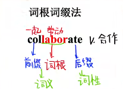
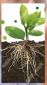

# 词根词缀

## 前缀（常用1~12）

1. 外、出：**e、ex、ef**

2. 内、进：**in、im**

3. 前-动态：**pro**

   前-静态：**pre**

4. 回、重新、再次：**re**

5. 聚集、一起、共同：**co、con、com、col**

6. 分散、分开：**di、dis、dif**

7. 上、超过：**super、over、sur**

8. 下、不足：**under、de、sub、sup**

9. 转移、转变：**trans**

10. 相互之间：**inter**

11. 强调、无意义：**a+双写辅音字母**

12. 否定前缀：**un、in、im、dis、ab、il**

## 后缀（常用1~3）

1. 动词后缀：**ate、ize、ify、ish**
2. 形容词后缀：**ent、ful、ous、al、ive、ible、able、ant**
3. 名词后缀：**lon、tion、ation、ness、ity、ality、ment、ence、ance、ism**

## 词根（常用55）

| 词根     |  词义  |  联想图  | 联想词|
| :------- | :---- | :-----: |:---- |
| **radi** | 地、根 |  |[radical](./词根联想词/radi.md)|

norm

vis

leg

ceed

duce

claim

verse

vade

gress

vent

ject

lect

spect

press

sense

valu

sim

tain

serve

view

tract

nov

rupt

dict

fer

clude

flu

scribe

dens