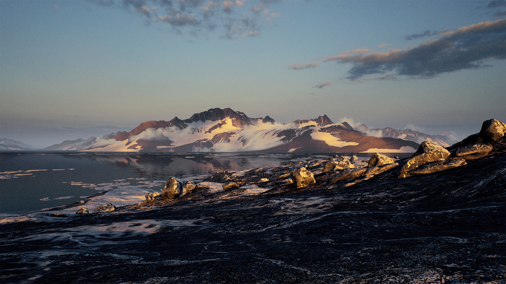
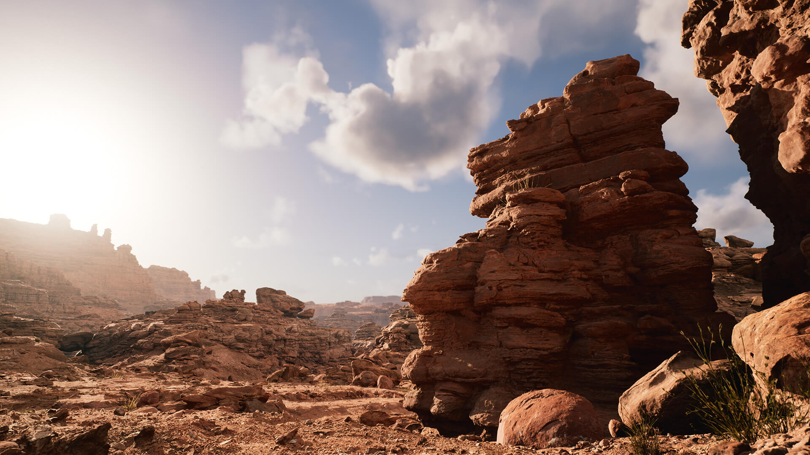
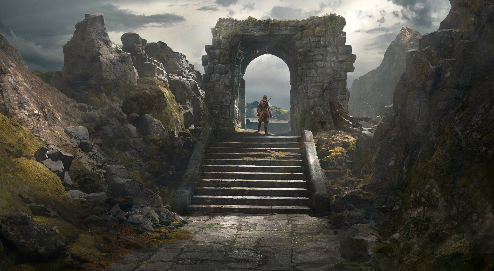
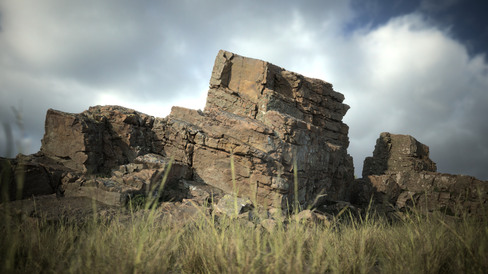
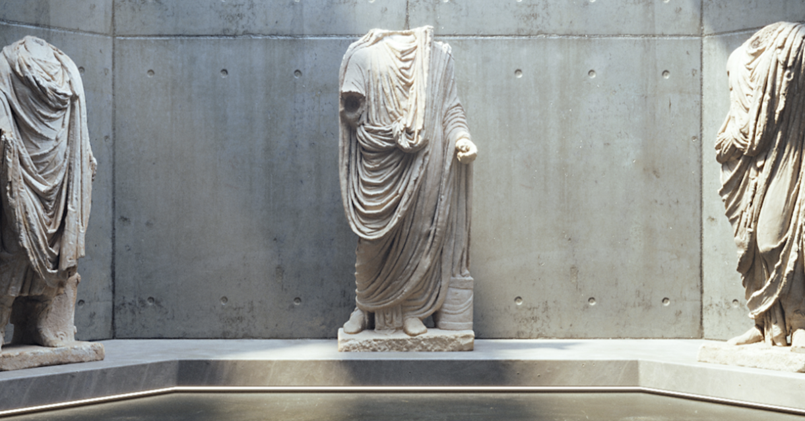

 
<i>
注意：以下材质或模型均为Epic Games提供的正版版权，可用于使用虚幻引擎开发的商业项目或学生参赛作品中。</i>
 
 

<table>
<thead>
<td colspan="2"><h4>风格:Stylized</h4></td>
</thead>
<tr>
<td>Stack O Bot</td>
<td>工程</td>
</tr>
<tr>
<td colspan="2">

</td>
</tr>
<tr>
<td>Stylized Asian Village</td>
<td>场景</td>
</tr>
<tr>
<td colspan="2">

</td>
</tr>
</table>
<table>
<tr>
<td>Stylized Fantasy Provencal</td>
<td>场景</td>
</tr>
<tr>
<td colspan="2">

</td>
</tr>
<tr>
<td>Stylized Egypt</td>
<td>场景</td>
</tr>
<tr>
<td colspan="2">

</td>
</tr>
<tr>
<td>Stylized Character Kit: Casual 01</td>
<td>角色</td>
</tr>
<tr>
<td colspan="2">

</td>
</tr>
</table>

<table>
<thead>
<td colspan="2"><h4 style="font-size:24px">动画</h4></td>
</thead>
<tr>
<td>动画初学者内容包</td>
<td>动画</td>
</tr>
<tr>
<td colspan="2">

</td>
</tr>
<tr>
<td>MCO Mocap Basics</td>
<td>动画</td>
</tr>
<tr>
<td colspan="2">

</td>
</tr>
</table>

<table>
<thead>
<td colspan="2"><h4 style="font-size:24px">材质</h4></td>
</thead>
<tr>
<td>Water Materials</td>
<td>水材质</td>
</tr>
<tr>
<td colspan="2">

</td>
</tr>
<tr>
<td>Advanced Glass Material Pack</td>
<td>玻璃材质</td>
</tr>
<tr>
<td colspan="2">

</td>
</tr>
<tr>
<td>Advanced Cel Shader Lite</td>
<td>后期处理</td>
</tr>
<tr>
<td colspan="2">

</td>
</tr>
</table>

<table>
<thead>
<td colspan="2"><h4 style="font-size:24px">特效</h4></td>
</thead>
<tr>
<td>Realistic Starter VFX Pack Vol 2</td>
<td>特效</td>
</tr>
<tr>
<td colspan="2">

</td>
</tr>
<tr>
<td>M5 VFX Vol2. Fire and Flames</td>
<td>特效</td>
</tr>
<tr>
<td colspan="2">

</td>
</tr>
<tr>
<td>Particles and Wind Control System</td>
<td>天气粒子</td>
</tr>
<tr>
<td colspan="2">

</td>
</tr>
<tr>
<td>Niagara Footstep VFX</td>
<td>走路粒子特效</td>
</tr>
<tr>
<td colspan="2">

</td>
</tr>
<tr>
<td>FX Variety Pack</td>
<td>魔法特效</td>
</tr>
<tr>
<td colspan="2">

</td>
</tr>
<tr>
<td>Basic Pickups VFX Set (Niagara)</td>
<td>拾取特效</td>
</tr>
<tr>
<td colspan="2">

</td>
</tr>
</table>

<table>
<thead>
<td colspan="2"><h4 style="font-size:24px">音效</h4></td>
</thead>
<tr>
<td>Interface & Item Sounds Pack
</td>
<td>界面与物品音效</td>
</tr>
<tr>
<td colspan="2">

</td>
</tr>
<tr>
<td>Sound Phenomenon Fantasy Orchestra
</td>
<td>音乐</td>
</tr>
<tr>
<td colspan="2">

</td>
</tr>
</table>

<table>
<thead>
<td colspan="2"><h4 style="font-size:24px">风格:次时代/写实</h4></td>
</thead>
<tr>
<td>Rural Australia
</td>
<td>场景</td>
</tr>
<tr>
<td colspan="2">

</td>
</tr>
<tr>
<td>Landscape Pro 2.0 Auto-Generated Material</td>
<td>工程</td>
</tr>
<tr>
<td colspan="2">

</td>
</tr>
<tr>
<td>Soul: 洞穴</td>
<td>场景</td>
</tr>
<tr>
<td colspan="2">

</td>
</tr>
<tr>
<td>Soul: 城市</td>
<td>场景</td>
</tr>
<tr>
<td colspan="2">

</td>
</tr>
<tr>
<td>City Park Environment Collection</td>
<td>场景</td>
</tr>
<tr>
<td colspan="2">

</td>
</tr>
<tr>
<td>Procedural Nature Pack Vol.1
</td>
<td>场景</td>
</tr>
<tr>
<td colspan="2">

</td>
</tr>
<tr>
<td>Megascans Trees: European Hornbeam
</td>
<td>场景</td>
</tr>
<tr>
<td colspan="2">

</td>
</tr>
<tr>
<td>Modular Building Set
</td>
<td>场景</td>
</tr>
<tr>
<td colspan="2">

</td>
</tr>
<tr>
<td>Procedural Building Generator
</td>
<td>建筑生成器</td>
</tr>
<tr>
<td colspan="2">

</td>
</tr>
<tr>
<td>Factory Environment Collection</td>
<td>场景</td>
</tr>
<tr>
<td colspan="2">

</td>
</tr>
<tr>
<td>Industry Props Pack 6
</td>
<td>场景</td>
</tr>
<tr>
<td colspan="2">

</td>
</tr>
<tr>
<td>ANIMAL VARIETY PACK
</td>
<td>动物</td>
</tr>
<tr>
<td colspan="2">

</td>
</tr>
<tr>
<td>Construction Site VOL. 1 - Supply and Material Props
</td>
<td>建筑工地道具</td>
</tr>
<tr>
<td colspan="2">

</td>
</tr>
<tr>
<td>Construction Site VOL. 2 - Tools, Parts, and Machine Props
</td>
<td>建筑工地道具</td>
</tr>
<tr>
<td colspan="2">

</td>
</tr>
<tr>
<td>古代山谷 Valley of the Ancient
</td>
<td>工程</td>
</tr>
<tr>
<td colspan="2">

</td>
</tr>
<tr>
<td>城市示例</td>
<td>工程</td>
</tr>
<tr>
<td colspan="2">

</td>
</tr>
<tr>
<td>熔岩之地合集</td>
<td>场景</td>
</tr>
<tr>
<td colspan="2">

</td>
</tr>
<tr>
<td>干枯草地合集</td>
<td>场景</td>
</tr>
<tr>
<td colspan="2">

</td>
</tr>
<tr>
<td>采石场合集</td>
<td>场景</td>
</tr>
<tr>
<td colspan="2">

</td>
</tr>
<tr>
<td>Modular SciFi Season 1 Starter Bundle
</td>
<td>科幻场景</td>
</tr>
<tr>
<td colspan="2">

</td>
</tr>
<tr>
<td>Modular Scifi Season 2 Starter Bundle
</td>
<td>科幻场景</td>
</tr>
<tr>
<td colspan="2">

</td>
</tr>
<tr>
<td>City Subway Train Modular
</td>
<td>科幻场景</td>
</tr>
<tr>
<td colspan="2">

</td>
</tr>
<tr>
<td>Spaceship Interior Environment Set
</td>
<td>科幻场景</td>
</tr>
<tr>
<td colspan="2">

</td>
</tr>
<tr>
<td>Landscape Backgrounds</td>
<td>场景</td>
</tr>
<tr>
<td colspan="2">

</td>
</tr>
<tr>
<td>Dynamic Grass System Lite</td>
<td>草地</td>
</tr>
<tr>
<td colspan="2">

</td>
</tr>
<tr>
<td>Megascans - Forest Path</td>
<td>场景</td>
</tr>
<tr>
<td colspan="2">

</td>
</tr>
<tr>
<td>Vehicle Variety Pack</td>
<td>机动车</td>
</tr>
<tr>
<td colspan="2">

</td>
</tr>
<tr>
<td>Vehicle Variety Pack Volume 2
</td>
<td>机动车</td>
</tr>
<tr>
<td colspan="2">

</td>
</tr>
<tr>
<td>FPS Weapon Bundle</td>
<td>武器</td>
</tr>
<tr>
<td colspan="2">

</td>
</tr>
<tr>
<td>Downtown West Modular Pack
</td>
<td>场景</td>
</tr>
<tr>
<td colspan="2">

</td>
</tr>
<tr>
<td>Megascans Abandoned Apartment 废弃的公寓</td>
<td>场景</td>
</tr>
<tr>
<td colspan="2">

</td>
</tr>
<tr>
<td>Megascans Goddess Temple 神庙</td>
<td>场景</td>
</tr>
<tr>
<td colspan="2">

</td>
</tr>
<tr>
<td>Megascans - Cyberpunk Environment</td>
<td></td>
</tr>
<tr>
<td colspan="2">

</td>
</tr>
<tr>
<td>Megascans - Post-Apocalyptic Street</td>
<td>废墟场景</td>
</tr>
<tr>
<td colspan="2">

</td>
</tr>
<tr>
<td>Megascans Desert Warzone</td>
<td>废墟场景</td>
</tr>
<tr>
<td colspan="2">

</td>
</tr>
<tr>
<td>Megascans Scary Restroom 恐怖卫生间</td>
<td>废墟场景</td>
</tr>
<tr>
<td colspan="2">

</td>
</tr>
<tr>
<td>Megascans Creature Gut 生物内脏</td>
<td></td>
</tr>
<tr>
<td colspan="2">

</td>
</tr>
<tr>
<td>Megascans Creature Skin 生物皮肤</td>
<td>材质</td>
</tr>
<tr>
<td colspan="2">

</td>
</tr>
<tr>
<td>Brushify</td>
<td>收费素材</td>
</tr>
<tr>
<td colspan="2">

</td>
</tr>
</table>

<table>
<thead>
<td colspan="2"><h4 style="font-size:24px">风格:Low Poly</h4></td>
</thead>
<tr>
<td>虚幻学习工具包</td>
<td>主素材</td>
</tr>
<tr>
<td colspan="2">

</td>
</tr>
<tr>
<td>Stylized Nature Pack
</td>
<td>场景</td>
</tr>
<tr>
<td colspan="2">

</td>
</tr>
<tr>
<td>Assetsville Town
</td>
<td>场景</td>
</tr>
<tr>
<td colspan="2">

</td>
</tr>
<tr>
<td>Free Fantasy Weapon Sample Pack</td>
<td>武器</td>
</tr>
<tr>
<td colspan="2">

</td>
</tr>
<tr>
<td>interactive stylized Lowpoly Grass</td>
<td>可交互草地</td>
</tr>
<tr>
<td colspan="2">

</td>
</tr>
<tr>
<td>Isometric - Interiors
</td>
<td>室内</td>
</tr>
<tr>
<td colspan="2">

</td>
</tr>
<tr>
<td>Craft Resources Icons</td>
<td>UI图标</td>
</tr>
<tr>
<td colspan="2">

</td>
</tr>
</table>

<table>
<thead>
<td colspan="2"><h4 style="font-size:24px">学习资源</h4></td>
</thead>
<tr>
<td>内容示例</td>
<td>教程</td>
</tr>
<tr>
<td colspan="2">

</td>
</tr>
<tr>
<td>Chaos 破坏演示</td>
<td>教程</td>
</tr>
<tr>
<td colspan="2">

</td>
</tr>
<tr>
<td>动作RPG</td>
<td></td>
</tr>
<tr>
<td>立体声音频模板</td>
<td></td>
</tr>
<tr>
<td>面部AR示例</td>
<td></td>
</tr>
<tr>
<td>Open World Demo Collection
 开放世界内容包</td>
<td></td>
</tr>
<tr>
<td>像素流送</td>
<td></td>
</tr>
<tr>
<td>摄像机内视效制片测试</td>
<td>影视</td>
</tr>
<tr>
<td>虚拟摄影棚</td>
<td>影视</td>
</tr>
<tr>
<td>虚拟摄像机</td>
<td>影视</td>
</tr>
<tr>
<td>Meerkat演示</td>
<td>动画</td>
</tr>
<tr>
<td>摄像机内视效制片测试</td>
<td>动画</td>
</tr>
<tr>
<td>MetaHumans</td>
<td>人物建模</td>
</tr>
<tr>
<td>虚幻与未来：广告职涯</td>
<td>广告</td>
</tr>
<tr>
<td>汽车配置器</td>
<td>汽车</td>
</tr>
<tr>
<td>汽车冬季场景</td>
<td>汽车</td>
</tr>
<tr>
<td>远程控制网页界面</td>
<td>HMI</td>
</tr>
<tr>
<td>temperate Vegetation: Foliage Collection</td>
<td></td>
</tr>
<tr>
<td>temperate Vegetation: Meadow Flowers</td>
<td></td>
</tr>
<tr>
<td>Megascans Meadow Pack 草甸合集</td>
<td></td>
</tr>
</table>

<table>
    <thead>
        <td><h4 style="font-size:24px">Quixel Bridge资源</h4></td>
    </thead>
    <tr>
        <td>
        
        </td>
    </tr>
        <tr>
        <td>
        
        </td>
    </tr>
        <tr>
        <td>
        
        </td>
    </tr>
        <tr>
        <td>
        
        </td>
    </tr>
</table>

 
 