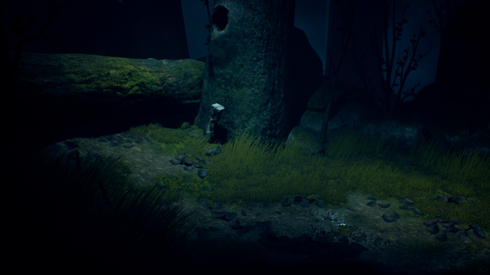
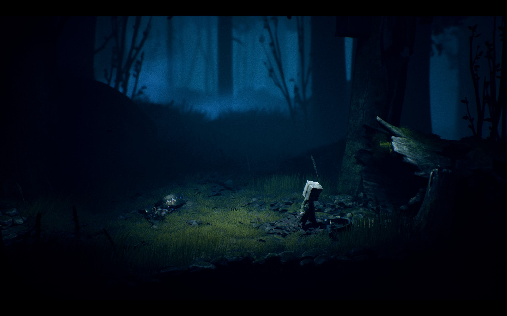

# 转载 b站——tt脑思 虚幻引擎5入门篇

https://gitee.com/timetzhang/LECTURE.UnrealEngine

# 开始

- [安装 Unreal Engine](https://www.bilibili.com/video/BV1Za4y1s7ti/)

  请访问 https://www.epicgames.com/zh-CN/
  
  右上角 “*获取客户端*” 下载 “*虚幻引擎5.0*”

# 入门

- [新建第一个游戏项目](https://www.bilibili.com/video/BV1Za4y1s7ti?p=2)
- [新建关卡]
- [修改编辑器的语言](https://www.bilibili.com/video/BV1Za4y1s7ti?p=7)
- [修改默认打开的关卡](https://www.bilibili.com/video/BV1Za4y1s7ti?p=8)

### 基本操作
- [游览](https://www.bilibili.com/video/BV1Za4y1s7ti?p=3)
- [变换操作与切换坐标系 "QWER"]
- [对齐操作](https://www.bilibili.com/video/BV1Za4y1s7ti?p=4)
- [快速定位目标 "F"或双击](https://www.bilibili.com/video/BV1Za4y1s7ti?p=5)
- [相机的移动速度 "鼠标滚轮"](https://www.bilibili.com/video/BV1Za4y1s7ti?p=6)
- [游戏视图 - 只显示游戏中的效果 "G"]
- [沉浸模式 "F11"]
- [书签 "Ctrl+数字"]
- [高分辨率截图]
- [性能优化 - 更改屏幕百分比]
- [性能优化 - 关闭实时]
- [性能优化 - 显示FPS]
- [切换视图模式 - 光照 无光照 线框]
- [切换视图模式 - 玩家碰撞]

### 创造世界
- [添加定向光源]
- [添加天空球体]
- [添加基础的平面、立方体、球体、圆柱体]
- [添加指数级高度雾]
- [添加体积光]
- [添加体积云]
- [添加天光]
- [添加后期处理体积]

### 完善世界
- [使用初学者内容包](https://www.bilibili.com/video/BV1Za4y1s7ti?p=9)
- [放置静态网格体]
- [设置材质]
- [放置各种光源](https://www.bilibili.com/video/BV1Za4y1s7ti?p=11)
- [打开物理引擎](https://www.bilibili.com/video/BV1Za4y1s7ti?p=13)
- [创建第一个 Actor 蓝图](https://www.bilibili.com/video/BV1Za4y1s7ti?p=14)
    - 添加 文本组件 Text Component
    - 添加 盒体碰撞器 Box Collision
- [编写第一段蓝图代码](https://www.bilibili.com/video/BV1Za4y1s7ti?p=15)
- [触发火焰蓝图](https://www.bilibili.com/video/BV1Za4y1s7ti?p=16)
    - 添加静态网格体
    - 添加火焰粒子

### 获取资源

- [使用虚幻商城]
- [设置保存位置](http://www.bilibili.com/video/BV1Za4y1s7ti?p=17)
- [准备素材](https://www.bilibili.com/video/BV1Za4y1s7ti?p=19)

- [如何使用资源](https://www.bilibili.com/video/BV1Za4y1s7ti?p=20)

### 初涉地形

- [创造一块地形](http://www.bilibili.com/video/BV1Za4y1s7ti?p=30)
- [使用各类地形工具](http://www.bilibili.com/video/BV1Za4y1s7ti?p=31)
- [创造海洋](http://www.bilibili.com/video/BV1Za4y1s7ti?p=32)
- [创造植物](http://www.bilibili.com/video/BV1Za4y1s7ti?p=33)

### 创建玩家

- [创建玩家角色]
- [创建游戏模式]
- [修改游戏模式](https://www.bilibili.com/video/BV1Za4y1s7ti?p=21)
- [修改玩家视角的摄像机](http://www.bilibili.com/video/BV1Za4y1s7ti?p=22)
- [玩家出生点的几种不同方式](https://www.bilibili.com/video/BV1Za4y1s7ti?p=12)
- [角色移动属性 - 行走速度与行走地面角度](http://www.bilibili.com/video/BV1Za4y1s7ti?p=23)
- [角色移动属性 - 跳跃](https://www.bilibili.com/video/BV1Za4y1s7ti?p=24)
- [角色移动属性 - 重力](https://www.bilibili.com/video/BV1Za4y1s7ti?p=25)
- [角色移动属性 - 多段跳]
- [为角色添加一个手电筒](https://www.bilibili.com/video/BV1Za4y1s7ti?p=26)
- [添加用户输入 - 开关手电筒]

### 导入模型

- [导入](https://www.bilibili.com/video/BV1Za4y1s7ti?p=27)
- [统一模型比例](https://www.bilibili.com/video/BV1Za4y1s7ti?p=28)
- [给静态网格体添加碰撞](https://www.bilibili.com/video/BV1Za4y1s7ti?p=29)
- 了解LOD
- 设置LOD

### 后期处理

- [后期处理体积 光照强度](http://www.bilibili.com/video/BV1Za4y1s7ti?p=37)
- [后期处理体积 镜头特效](http://www.bilibili.com/video/BV1Za4y1s7ti?p=38)
- [后期处理体积 调色](http://www.bilibili.com/video/BV1Za4y1s7ti?p=39)

### 初涉粒子

- [添加一些漂浮的闪光粒子](http://www.bilibili.com/video/BV1Za4y1s7ti?p=40)
- [卡通烟雾]
- [卡通火焰]

### 初涉声音

- [导入音频](http://www.bilibili.com/video/BV1Za4y1s7ti?p=41)
- [BGM / 循环播放](http://www.bilibili.com/video/BV1Za4y1s7ti?p=42)
- [MP3转WAV](http://www.bilibili.com/video/BV1Za4y1s7ti?p=43)
- [给火加一个音效](http://www.bilibili.com/video/BV1Za4y1s7ti?p=44)
- [剪切音频]
- [空间化声音]
- [衰减 - 距离]
- [衰减 - 空气吸收 滤波 LPF]
- [衰减 - 空间形状]
- [混响 Reverb]
- [动态处理]
- [EQ]
- [混响]
- [合成器]
- [Sound Cue 对声音进行蓝图]
- [Sound Cue 制作多普勒音效]

### 初涉材质 (Optional)

- [基础颜色](http://www.bilibili.com/video/BV1Za4y1s7ti?p=45)
- [混合模式与双面](http://www.bilibili.com/video/BV1Za4y1s7ti?p=46)
- [金属感 高光 与 粗糙度](http://www.bilibili.com/video/BV1Za4y1s7ti?p=47)
- [自发光](http://www.bilibili.com/video/BV1Za4y1s7ti?p=48)
- [纹理贴图](http://www.bilibili.com/video/BV1Za4y1s7ti?p=49)
- [法线贴图](http://www.bilibili.com/video/BV1Za4y1s7ti?p=50)
- [导入纹理](http://www.bilibili.com/video/BV1Za4y1s7ti?p=51)
- [贴花材质](http://www.bilibili.com/video/BV1Za4y1s7ti?p=52)
- [贴花材质 - 取消接收贴画](http://www.bilibili.com/video/BV1Za4y1s7ti?p=53)
- [贴花材质 - 制作法线贴图](http://www.bilibili.com/video/BV1Za4y1s7ti?p=54)
- [贴花材质 - 完成贴花](http://www.bilibili.com/video/BV1Za4y1s7ti?p=55)

#### [P.S 其他材质课程](https://www.bilibili.com/video/BV19t4y1e7Dw/?spm_id_from=333.999.0.0)

### 初涉过场动画

- [创建一个镜头动画](http://www.bilibili.com/video/BV1Za4y1s7ti?p=56)
    - 做动画前将视窗调节至双视图, 左透视，右序列器
    - 快捷键 "s" 打关键帧
- [不同机位剪辑](http://www.bilibili.com/video/BV1Za4y1s7ti?p=57)
- [其他元素动画](http://www.bilibili.com/video/BV1Za4y1s7ti?p=58)
- [灯光动画](http://www.bilibili.com/video/BV1Za4y1s7ti?p=59)
- [摄像机晃动]
- [自动播放动画](http://www.bilibili.com/video/BV1Za4y1s7ti?p=60)
- [序列录制器](http://www.bilibili.com/video/BV1Za4y1s7ti?p=61)
- [添加角色动画](http://www.bilibili.com/video/BV1Za4y1s7ti?p=62)
- [时间膨胀](http://www.bilibili.com/video/BV1Za4y1s7ti?p=63)
- [渐变轨道](http://www.bilibili.com/video/BV1Za4y1s7ti?p=64)
- [音频轨道](http://www.bilibili.com/video/BV1Za4y1s7ti?p=65)
- [导出动画](http://www.bilibili.com/video/BV1Za4y1s7ti?p=66)

### 初涉建模 (Optional)
 - [打开UE建模工具]
 - [标准体]
 - [多边形挤压]
 - [路径挤压]
 - [编辑多边形]
 - [编辑三角形]
 - [造型]
 - [雕刻]
 - [编辑枢轴点]
 - [优化 减面]
 - [优化 重构]
 - [体素]
 - [自动UV]
 - [UV解包]
 - [UV缝合]
 - [UV变换]
 - [UV布局]

### 初涉UI
- [主菜单]
- [进度条]

### 初涉关卡设计
- [大按钮]
- [超级大灯]
- [左右平移的平台]
- [向上平移的平台]
- [多层平台]
- [大风扇]
- [超级弹跳床]
- [打开多个阀门，才能打开机关]
- [固定镜头：狭窄的通道天桥]
- [生成球体阵]
- [丢下一个大灯球]
- [阻挡体积]
- [向上的冲击通道]
- [漂浮的区域]
- [重力变化的区域]
- [瞬移]
- [向你开炮]

- [超级英雄附体]
- [制作巨石阵]
- [巨石阵飞行]
- [向目标飞行]
- [按固定路线飞行]

- [推箱子/拉箱子]
- [踩机关突降巨石]
- [后面滚落的巨石]

- [从天而降的炮弹]
- [别让自己，而是让物品触发机关]

- [激光阻挡去路]
- [掉落深渊回复活点]
- [发射物]
- [追逐，快点通过]
- [旋转加漂浮的大石头]
- [打开冲击波，赶快跑过去]
- [0.2秒的反应时间]
- [超级大秋千]
- [不同的按钮 不同的物理]

### 作业：地图编辑

- 地编实例：创造一个戈壁
- 地编实例：创造一个森林
- 地编实例：创造一个沙滩

# 角色入门

- [替换角色骨骼网格体](http://www.bilibili.com/video/BV1Za4y1s7ti?p=67)
- [重定向动画蓝图](http://www.bilibili.com/video/BV1Za4y1s7ti?p=68)
- [重定向动画](http://www.bilibili.com/video/BV1Za4y1s7ti?p=69)
- [Begin 开始事件 与 Print](http://www.bilibili.com/video/BV1Za4y1s7ti?p=70)
- [显示鼠标光标](http://www.bilibili.com/video/BV1Za4y1s7ti?p=71)
- [添加注释](http://www.bilibili.com/video/BV1Za4y1s7ti?p=72)
- [Tick事件](http://www.bilibili.com/video/BV1Za4y1s7ti?p=73)
- [鼠标滚轮控制摄像机](http://www.bilibili.com/video/BV1Za4y1s7ti?p=74)
- [使用Clamp限制数值](http://www.bilibili.com/video/BV1Za4y1s7ti?p=75)
- [操作映射](http://www.bilibili.com/video/BV1Za4y1s7ti?p=76)
- [技能：超级跳](http://www.bilibili.com/video/BV1Za4y1s7ti?p=77)
- [冷却时间 / Do Once](http://www.bilibili.com/video/BV1Za4y1s7ti?p=78)
- [添加特效与声效](http://www.bilibili.com/video/BV1Za4y1s7ti?p=79)
- [技能：多段跳](http://www.bilibili.com/video/BV1Za4y1s7ti?p=80)
- [技能 - 拾取技能石](http://www.bilibili.com/video/BV1Za4y1s7ti?p=81)
- [技能 - 漂浮的技能石](http://www.bilibili.com/video/BV1Za4y1s7ti?p=82)
- [技能 - 萤火 - 添加动画](http://www.bilibili.com/video/BV1Za4y1s7ti?p=83)
- [技能 - 萤火 - 粒子](http://www.bilibili.com/video/BV1Za4y1s7ti?p=84)
- [技能 - 萤火 - 蓝图](http://www.bilibili.com/video/BV1Za4y1s7ti?p=85)
- [技能 - 萤火 - 完成技能](http://www.bilibili.com/video/BV1Za4y1s7ti?p=86)
- [技能 - 径向力 - 添加输入与动画](http://www.bilibili.com/video/BV1Za4y1s7ti?p=87)
- [技能 - 径向力 - 添加径向力 Radial Force](http://www.bilibili.com/video/BV1Za4y1s7ti?p=88)
- [技能 - 径向力 - 摄像机晃动](http://www.bilibili.com/video/BV1Za4y1s7ti?p=89)

## 场景

- [设置边界 / 阻挡体积](http://www.bilibili.com/video/BV1Za4y1s7ti?p=90)
- [掉落深渊返回原地](http://www.bilibili.com/video/BV1Za4y1s7ti?p=91)
- [超级大风扇 /  Timeline](http://www.bilibili.com/video/BV1Za4y1s7ti?p=92)
- [瞬移门 Target Point](http://www.bilibili.com/video/BV1Za4y1s7ti?p=93)
- [点击事件](http://www.bilibili.com/video/BV1Za4y1s7ti?p=94)
- [Gate节点](http://www.bilibili.com/video/BV1Za4y1s7ti?p=95)
- [开关门 / Timeline 与 Gate](http://www.bilibili.com/video/BV1Za4y1s7ti?p=96)
- [点亮灯](http://www.bilibili.com/video/BV1Za4y1s7ti?p=97)
- [子蓝图](http://www.bilibili.com/video/BV1Za4y1s7ti?p=98)
- [点亮所有灯](http://www.bilibili.com/video/BV1Za4y1s7ti?p=99)
- [通用开关 事件分发器](http://www.bilibili.com/video/BV1Za4y1s7ti?p=100)
- [按路径漂浮的岛 - 添加样条组件](http://www.bilibili.com/video/BV1Za4y1s7ti?p=101)
- [按路径漂浮的岛 - 编写蓝图](http://www.bilibili.com/video/BV1Za4y1s7ti?p=102)
- [关卡切换](http://www.bilibili.com/video/BV1Za4y1s7ti?p=103)
- [关卡流送](http://www.bilibili.com/video/BV1Za4y1s7ti?p=104)

## 构造脚本 Construction Script 

- [简介](http://www.bilibili.com/video/BV1Za4y1s7ti?p=105)
- [动态添加静态网格体组件](http://www.bilibili.com/video/BV1Za4y1s7ti?p=106)
- [循环生成静态网格体 / For](http://www.bilibili.com/video/BV1Za4y1s7ti?p=107)
- [使用FOR循环创造栅栏](http://www.bilibili.com/video/BV1Za4y1s7ti?p=108)
- [使用数组优化栅栏](http://www.bilibili.com/video/BV1Za4y1s7ti?p=109)
- [使用Spline生成石头墙](http://www.bilibili.com/video/BV1Za4y1s7ti?p=110)

## 角色
- 准备新世界
- Lumen设置
- 使用Nanite资源与Quixel Bridge
- 模块化网格体
- 使用模块化网格体构建世界
- 完成场景
- MetaHuman - 创造角色
- MetaHuman - 使用Bridge下载
- MetaHuman - 做为第三人称角色
- MetaHuman - 重定向设置
- 使用低模人物
- 准备动画
- 了解动画蓝图
- 移动能力 - 待机与跑步
- 移动能力 - 行走
- 移动能力 - 疾速跑
- 移动能力 - 蹲伏 - 添加输入
- 移动能力 - 蹲伏 - 动画蓝图
- 角色属性 - 行动点数 - 消耗与恢复
- 角色属性 - 行动点数 - 触发消耗
- 角色属性 - 行动点数 - 修改蓝图
- 角色属性 - 行动点数 - 优化蓝图
- 角色属性 - HP - 伤害事件
- 角色属性 - HP - 伤害动画
- 角色属性 - HP - 测试伤害
- 角色属性 - HP - 伤害等级
- 角色属性 - HP - 禁止移动
- 角色属性 - HP - 火球发射物
- 角色属性 - HP - 火球发射器
- 角色属性 - HP - 如何获取两者的距离与方向
- 角色属性 - HP - 火球的空间化声音
- 角色属性 - HP - 火球的伤害
- 角色属性 - HP - 火球撞到地面
- 角色属性 - HP - 衰减音效
- 角色属性 - HP - 单次加血光环
- 角色属性 - HP - 持续加血光环
- 角色属性 - MP
- 技能 - 准备资源
- 技能 - 火球 - 添加输入与动画
- 技能 - 火球 - 修改发射物
- 技能 - 火球 - 发射蓝图
- 技能 - 火球 - 碰撞设置
- 技能 - 火球 - 生命周期
- 技能 - 火球 - 添加一个可被伤害的NPC
- 技能 - 火球 - 子蓝图实现父蓝图事件
- 技能 - 火球 - 消耗MP
- 技能 - 火球 - 添加冲量
- 技能 - AOE - 添加输入与动画
- 技能 - AOE - 准备粒子特效
- 技能 - AOE - 技能蓝图
- 技能 - AOE - 施放技能蓝图
- 技能 - AOE - 摄像机晃动
- 技能 - 瞬移 - 显示鼠标光标
- 技能 - 瞬移 - 施放技能蓝图
- 技能 - 瞬移 - 瞬移最大距离
- 技能 - 重力控制 - 添加输入与动画
- 技能 - 重力控制 - 施放技能蓝图
- 技能 - 重力控制 - 第二种技能玩法
- 技能 - 重力控制 - 角色朝向
- 技能 - 射击 - 安装射击武器
- 技能 - 射击 - 拿武器与收武器
- 技能 - 射击 - 跑步与待机
- 技能 - 射击 - 子弹发射物
- 技能 - 射击 - 优化子弹
- 技能 - 射击 - 摄像机位置
- 技能 - 射击 - 瞄准偏移
- 技能 - 射击 - 完成瞄准偏移
- 技能 - 射击 - 瞄准偏移的动画蓝图设置
- 技能 - 射击 - 向鼠标位置射击
- 技能 - 射击 - 连发
- 坐椅 - 准备资源
- 坐椅 - 准备动画与动画蓝图
- 坐椅 - 待机与奔跑
- 坐椅 - 蒙皮
- 坐椅 - 坐椅的父类
- 坐椅 - 将角色附加到坐椅
- 坐椅 - 添加插槽
- 坐椅 - 添加坐姿
- 坐椅 - 不同坐骑切换不同宽度
- 坐椅 - 下马
- 刀剑 - 添加输入与动画
- 刀剑 - 附魔
- 刀剑 - 伤害
- 伤害UI - 创建
- 伤害UI - 使用

## Chaos物理系统 
- 创建可被破坏的物体
- 多层级破裂
- 群集化的破裂
- 几何体集的材质
- 伤害阈值
- 瞬态场Transient Fields与张力场
- 构造场Construction Fields与Anchor Fields锚点场
- 持久场Persistent Fields与禁止场
- 优化蓝图点击选择
- 爆炸 - 径向向量
- 优化爆炸 - 运算符域
- 优化爆炸 - 扭矩与随机
- 粒子特效 - 破裂与碰撞事件
- 粒子特效 - 事件驱动粒子系统
- 粒子特效 - 完成粒子特效
- 绑定Chaos破裂或碰撞事件
- 子弹

## 布料
- 布料与风
- 布料属性
- 布料碰撞
- 人物布料

## 物品
- 理解面向对象
- 用“类”创建物品 / 父类 Pickup Item
- 拾取物品
- 接口

## AI
- 添加NPC
- 添加HP
- 添加技能：拳击
- 添加技能：射击
- 使用UI来显示NPC对话内容
- 持续伤害
- Pain Causing Volume
- 绑定受伤动画
- 添加受伤音效
- 引火上身
- 角色死亡
- AIController
- 移动到位置
- 导航 / Nav Mesh
    - 快捷键"P"显示
- RecastNavMesh
- 生成AI / 从类生成AI
- 创建行为树与黑板
    - 为行为树关联黑板
    - AIController运行行为树
- 创建巡逻NPC
- AI视觉
    - AIPerception
    - 装饰器节点
    - 服务节点
- 开启AI调试
- AI听觉
    - Play Sound at Location
    - Report Noise Event(Instigator)
- EQS Environment Query System
    - EQS
    - EQS Testing

## UI
- 创建UMG
- Button 按钮
- Textbox 文本
- Layout 布局
- 排列
- Slider 滑动
- Loading 载入
- Input 控件
- Progress Bar 进度条
- 3D Widgets
- 动画
- 场景截图 Texture

## 暂停菜单
- 暂停菜单UI / 动态添加Post Processing
- 添加暂停按钮

## 背包
- 背包UI
- 完成背包
- 为物品“类”添加“行为”（只能使用纯类）
- 使用物品

## MetaSound
- 

## 存档
-游戏存档

## 骨骼物理
- 局部受伤
- 让击中的骨骼受伤
- 运动学权重

## 物理Actor
- 钢体物理
- 约束力 Constraint
- 约束力 Constraint Angular Motor
- 约束力 Constraint Linear Motor
- 约束力 Constraint Breakable
- Physics Volume

## 动画详解
- 播放动画
- 使用Bool控制动画
- 混合空间
- 瞄准偏移
- 蒙太奇
- 曲线
- IK
- Root Motion
- Morph
- 拖尾

## 声音
- 导入WAV或MP3音频
- 空间化声音
- 衰减 - 距离
- 衰减 - 空气吸收 滤波 LPF
- 衰减 - 空间形状
- 混响 Reverb
- Sound Cue 对声音进行蓝图
- Sound Cue 制作多普勒音效

## 高级光照
- Lightmass Importance Volume
- - 静态光照
- 贴图分辨率
    - 查看分辨率(变成绿色)
- Post Processing 开启光线追踪
- Post Processing 更多光的细节设置
- GPU LightMass(R.Ray.Force)
    - 项目设置（Ray? ，虚拟纹理，默认rhi Directx
- Lightmass Character Indirect Detail Volume
- Precomputed Visibility Volume
- Precomputed Visibility Override Volume
- 反射球
- IES
- 光照函数
    - 坏了的灯

## 运动组件
- 角色运动
- 抛射运动
- 汽车运动
- 飞行运动
- 自定义运动

## Post Processing
- 电影1
- 电影2
- 电影3
- 游戏
- Screen Percentage
- Blendable
- 混合半径与权重

## 数据
- 数据表格

## Paper2D

## 其他角色类型

- 创建TopDown
- 创建一个球
- 创建汽车
- 创建飞翔

创建一个放置建筑的游戏

创建一个跑步游戏

飞行游戏

汽车游戏r

---------------

###第三阶段
高级光照，动画制作，蓝图动画，场景优化，实时光线追踪，不同的运动组件

准备新世界
推荐几个megascan的超帅场景，为静态光照 动画 电影做准备
草原牧场
temperate Vegetation: Foliage Collection
temperate Vegetation: Meadow Flowers
Megascans——Meadow Pack
Landscape Backgrounds
Brushify
废墟公寓
Megascans Abandoned Apartment
山洞蜡烛
Megascans Goddess Temple
Lake House

Sequencer 制作动画
准备场景
添加摄像机并运镜
蓝图控制动画

人物动画
如果一个Animation包含很多动作，就用Subscenes Track把这场戏做到一起。
Sequencer Recorder 
添加更多场景元素

优化场景
Level Streaming
Cuiling Distance
LOD
动态载

动画蓝图
制作一个大头娃娃 蓝图与动画蓝图通讯
转身动画
创建一个新的动画资产，并为人物添加该行为
导入更多的人物动画

Blender For UE

--------------------

###第四阶段
Cascade粒子系统，Niagara粒子系统与Chaos物理系统

1. beam
2. 烟雾
3. 魔法门

---------------------

###第五阶段
材质，介绍各种材质的制作方法，Pivot

玻璃
Pivot

###第六阶段
NPC AI，Morph Target，

Morph Target

AI和行为树
在两点之间巡逻
NavMesh

第七阶段
网络游戏，服务器架设与数据库基础，多人游戏基础

多人游戏基础

