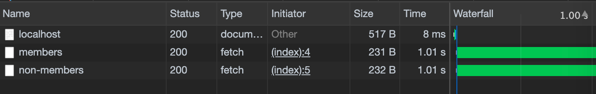

# Async/Await 注意

您能发现这段代码的问题吗？

```javascript
async function getPeople() {
  const members = await fetch("/members");
  const nonMembers = await fetch("/non-members");

  return members.concat(nonMembers);
}
```

没有async / await语法的情况如下所示：

```javascript
function getPeople() {
  return fetch("/members")
    .then(members => fetch("/non-members")
      .then(nonMembers => members.concat(nonMembers)))
}
```

> 这是上面在网络日志中的样子：


我们已经完成了两个独立的异步任务，并将它们放入__序列中__。此功能所需时间是所需时间的两倍。

应该是这样的：

```javascript
async function getPeople() {
  const members = fetch("/members");
  const nonMembers = fetch("/non-members");
  const both = await Promise.all([ members, nonMembers ]);

  return both[0].concat(both[1]);
}
```

或者，没有异步/等待：

```javascript
function getPeople() {
  const members = fetch("/members");
  const nonMembers = fetch("/non-members");

  return Promise.all([ members, nonMembers ])
          .then(both => both[0].concat(both[1]));
}
```

如下所示：




## 易犯错误


## 缓解这个问题

如果您不确定代码的行为方式，请查看瀑布图，看看您是否有机会轻松提高应用程序速度。

您还可以使用以下经验法则：如果一个`await`ed函数调用未使用另一个`await`函数调用的结果（或从该结果派生的结果），则应`Promise.all()`使它们同时发生。


> 原文链接：[Beware of Async/Await](https://www.brandonsmith.ninja/blog/async-await)