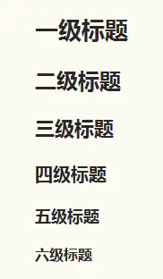

## 标题

1. 前面带#号，后面带文字，分别表示h1-h6,只到h6，而且h1下面会有一条横线

    ```markdownma
    # 一级标题
    ## 二级标题
    ### 三级标题
    #### 四级标题
    ##### 五级标题
    ###### 六级标题
    ```

2. 相当于标签闭合

    ```markdown
    # 一级标题 #
    ## 二级标题 ##
    ### 三级标题 ###
    #### 四级标题 ####
    ##### 五级标题 #####
    ###### 六级标题 #####
    ```

> 效果如下：




