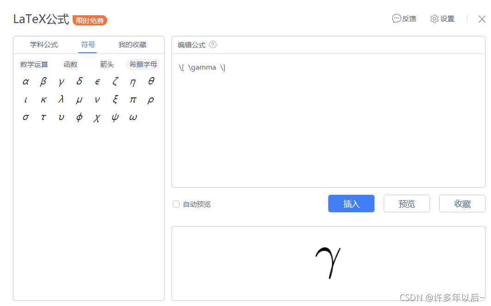

### 1.打开Typora选择数学模块

三种打开方式：

- 点击“段落” --> “公式块”
- 快捷键ctrl + shift +m
- “$$” + 回车

### 2.添加数学公式

输出美观的数学公式，需要知道他们的格式和代码！
ps:Typora有时出现公式块无法删除，可能是软件bug，Ctrl + / 打开源代码模式，在这里面可以进行删除
$$
e^{i\pi+1}=2
$$

## 3.常用的公式格式代码练习

```markdown
\\ 公式内换行（公式后面加）
```

##### 常用基本函数：

```markdown
$$
x^2 // 上下标
1/2 // 分式
\frac{1}{2} // 分式2
\cdots // 省略号
\sqrt{4} // 开根号
\vec{a} // 矢量
\int{x}dx // 积分1
\int_{1}^{2}dx // 积分2
\lim{a + b} // 极限1
\lim_{n\rightarrow + \infty} // 极限2
\sum_{n=1}^{100}{a_n} // 累加
\prod_{n=1}^{199}{x_n} // 累乘
\sin{(x + y)} // 三角函数
\ln2 // 对数函数1
\log_28 // 对数函数2
```

$$
\$$\\
x^2 \quad 上下标\\
1/2 \quad 分式\\
\frac{1}{2} \quad 分式2\\
\cdots \quad 省略号\\
\sqrt{4} \quad 开根号\\
\vec{a} \quad 矢量\\
\int{x}dx \quad 积分1\\
\int_{1}^{2}dx \quad 积分2\\
\lim{a + b} \quad 极限1\\
\lim_{n\rightarrow + \infty} \quad 极限2\\
\sum_{n=1}^{100}{a_n} \quad 累加\\
\prod_{n=1}^{199}{x_n} \quad 累乘\\
\sin{(x + y)} \quad 三角函数\\
\ln2 \quad 对数函数1\\
\log_28 \quad 对数函数2\\
$$

##### 公式块内左对齐

```markdown
$$
\begin{aligned} //
&1、y = \sin(x) \\ &为对齐格式符
&2、
\end{aligned}
$$
```

$$
\begin{aligned}
&1、y = \sin(x) \\
&2、
\end{aligned}
$$
##### 下标为多个英文字母时，使用{}包起来：

```markdown
$$
v_{体积}
$$
```

$$
v_{体积}
$$

##### 关系运算符：

```markdown
$$
\pm // ±
\times // ×
\div // ÷
\equiv // ==
\le // <=
\leq // <=2
\ge // >=
\geq // >=2
\not= // 不等号
\approx // 约等于

$$
```

$$
\pm \\
\times \\
\div \\
\equiv \\
\leq \\
\geq \\
$$

##### 花括号公式组合：

```markdown
$$
c(u) = 
\begin{cases}
\sqrt\frac{1}{n}, u = 0 \\
\sum_{n=1}^{100}{a_n}, n \neq0
\end{cases}
$$
```

$$
c(u) = 
\begin{cases}
\sqrt\frac{1}{n}, u = 0 \\
\sum_{n=1}^{100}{a_n}, n \neq0
\end{cases}
$$

##### 空格：

```markdown
$$
a \quad b
$$
```

$$
a \quad b
$$

##### 矩阵：

```markdown
$$
\begin{matrix}
0&1&1\\
1&1&0\\
1&0&1\\
\end{matrix}
$$
```

$$
\begin{matrix}
0&1&1\\
1&1&0\\
1&0&1\\
\end{matrix}
$$

##### 在起始、结束标记用下列词替换 `matrix`：

- `pmatrix`：小括号边框
- `bmatrix`：中括号边框
- `Bmatrix`：大括号边框
- `vmatrix`：单竖线边框
- `Vmatrix`：双竖线边框

```markdown
$$
\begin{pmatrix}
0&1&1\\
1&1&0\\
1&0&1\\
\end{pmatrix}
$$
```

$$
\begin{pmatrix}
0&1&1\\
1&1&0\\
1&0&1\\
\end{pmatrix}
$$

##### 特殊字符及希腊字母表：

```markdown
\infty // 无穷
\emptyset // 伊普西龙
```

$$
\infty \quad 无穷\\
\emptyset \quad 伊普西龙
$$

[其他](https://blog.csdn.net/weixin_44549795/article/details/105666371)


## 4.更多字符

更多特殊字符及希腊字母代码见wps中LaTex公式符号

