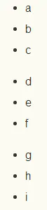
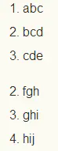
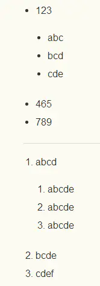

## 列表

1. 无序列表

   ```markdown
   //形式一
   + a
   + b
   + c
   //形式二
   - d
   - e
   - f
   //形式三
   * g
   * h
   * i
   ```

   

> 效果如下：



   

2. 有序列表

   ```markdown
   //正常形式
   1. abc
   2. bcd
   3. cde
   //错序效果
   2. fgh
   3. ghi
   5. hij
   ```

> 效果如下：



> 如图，注意，数字后面的点只能是英文的点，
>
> 有序列表的序号是根据第一行列表的数字顺序来的，
>
> 错序列表的序号本来是序号是乱的，
>
> 但是还是显示 2 3 5


3. 嵌套列表

   ```markdown
   //无序列表嵌套
   + 123
       + abc
       + bcd
       + cde
   + 465
   + 789
   //有序列表嵌套
   1. abcd
       1. abcde
       2. abcde
       3. abcde
   2. bcde
   3. cdef
   ```

> 效果如下：

