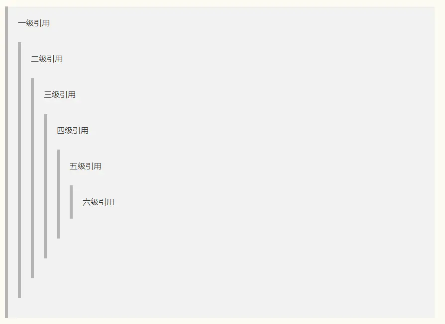

## 引用说明区块

1. 正常形式

   ```markdown
   > 引用内容、说明内容。在语句前面加一个 > ，注意是英文的那个右尖括号，注意空格，引用因为是一个区块，理论上是应该什么内容都可以放，比如说：标题，列表，引用等等。
   ```

> 效果如下：


2. 嵌套区块

   这里我只介绍一下我常用的方法，也是个人认为比较规范的一种方法，就是给区块的下一级区块多加一个右尖括号

   ```markdown
   > 一级引用
   >> 二级引用
   >>> 三级引用
   >>>> 四级引用
   >>>>> 五级引用
   >>>>>> 六级引用
   ```

> 效果如下：

