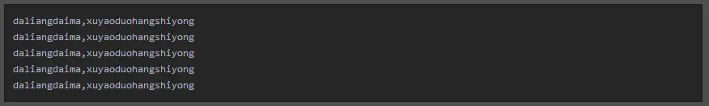

# 代码块

1. 少量代码，单行使用，直接用`包裹起来就行了

    ```markdown
    ` shaoliangdaima,danhangshiyong `
    ```

    > 效果图：

    

2. 大量代码，需要多行使用，用*```*包裹起来
	

    ~~~markdown
    ```
        daliangdaima,xuyaoduohangshiyong
        daliangdaima,xuyaoduohangshiyong
        daliangdaima,xuyaoduohangshiyong
        daliangdaima,xuyaoduohangshiyong
        daliangdaima,xuyaoduohangshiyong
    ```
    ~~~

   > 效果图：
   
   