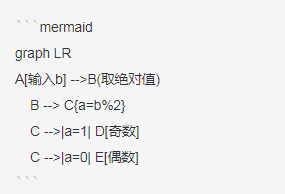
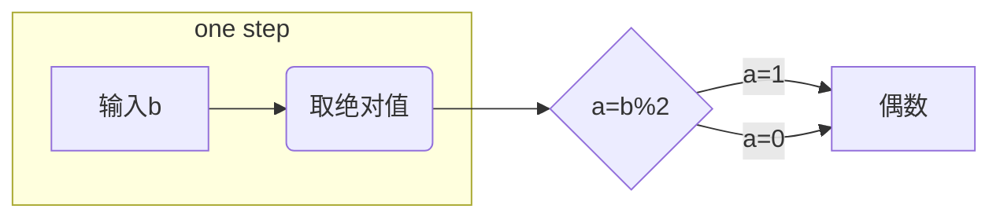
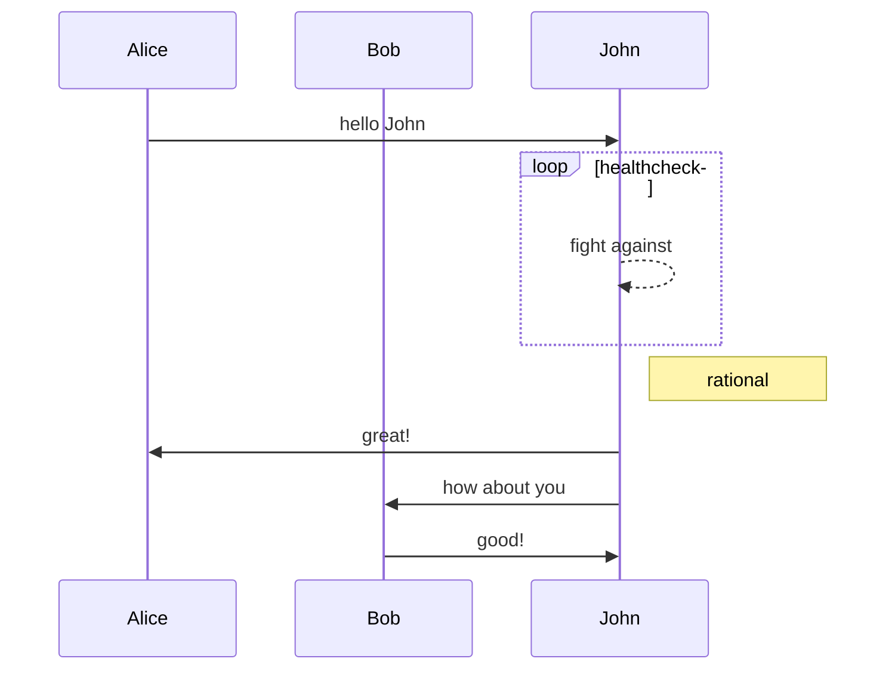
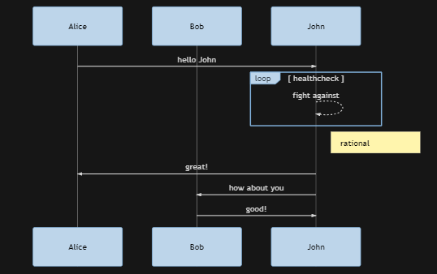
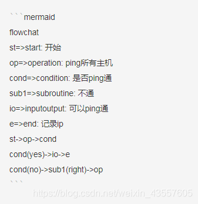

## 流程图 Mermaid

#### Graph

```
graph TB（top--botom 上下排列）
graph BT  (botom--top)
graph LR（left--right 左右排列）
graph RL (right--left)
-->    在流程图中显示——>
---    在流程图中显示——
```



> 效果如下：



------



> 效果如下：



------



> 效果如下：

*显示不出来这个图，可能是预览插件没装。*

```mermaid
flowchart
st => start: 开始
op => operation: ping所有主机
cond => condition: 是否ping通
sub1 => subroutine: 不通
io => inputoutput: 可以ping通
e => end: 记录ip
st -> op -> cond
cond(yes) -> io -> e
cond(no) -> sub1(right) -> op
```


#### 时序图

#### 甘特图

http://www.mamicode.com/info-detail-2386998.html