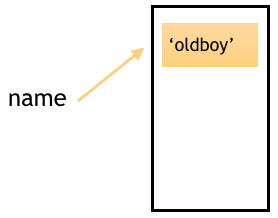
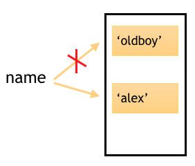
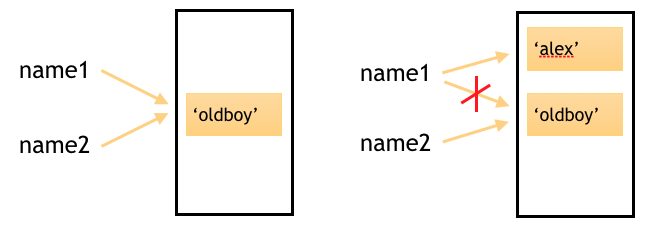

## 变量

1.不以数字开头

2.字母、数字或下划线的任意组合

3.以下关键字不能声明为变量名

[‘and’, ‘as’, ‘assert’, ‘break’, ‘class’, ‘continue’, ‘def’, ‘del’, ‘elif’, ‘else’, ‘except’, ‘exec’, ‘finally’, ‘for’, ‘from’, ‘global’, ‘if’, ‘import’, ‘in’, ‘is’, ‘lambda’, ‘not’, ‘or’, ‘pass’, ‘print’, ‘raise’, ‘return’, ‘try’, ‘while’, ‘with’, ‘yield’]

#### 驼峰体

```python
AgeOfOldboy = 56 
NumberOfStudents = 80
```

#### 下划线

```python
age_of_oldboy = 56 
number_of_students = 80
```

#### 赋值

```python
name = "小明"
age = 22
height = 160
```


## 常量

Python中没有一个专门的语法代表常量，程序员约定俗成用变量名全部大写代表常量

```python
AGE_OF_OLDBOY = 56
```


## 变量创建过程

首先，当我们定义了一个变量name = ‘oldboy’的时候，在内存中其实是做了这样一件事：

程序开辟了一块内存空间，将‘oldboy’存储进去，再让变量名name指向‘oldboy’所在的内存地址。如下图所示：



**我们可以通过id()方法查看这个变量在内存中的地址**

```python
name = "oldboy"
id(name)
# 4317182304
```

**id**与**is**配合使用

```python
l1 = [1,2,3]
l2 = [1,2,3]

l1 == l2 # True 判断值
l1 is l2 # False 判断内存地址
id(l1) == id(l2) # 同上
```

**注意**

```python
s1 = 'wlp'
s2 = 'wlp'
s1 == s2 # True
s1 is s2 # True
```

## 变量的修改

<font color=red>一般我们认为修改一个变量就是用新值把旧值覆盖掉， 可python是这样实现的么？</font>

```
>>> name = "oldboy"
>>> id(name)
4317182304
>>> 
>>> name = "alex" 
>>> id(name)  # 如果只是在原有地址上修改，那么修改后内存地址不应该变化呀。
4317182360
```

实际的原理什么样的呢？ 程序先申请了一块内存空间来存储‘oldboy’，让name变量名指向这块内存空间

执行到name=‘alex’之后又申请了另一块内存空间来存储‘alex’，并让原本指向‘oldboy’内存的链接断开，让name再指向‘alex’。




#### 变量的指向关系

<font color=red>提问：下面这段代码为何出现这样的现象？</font>

```
>>> name1 = 'oldboy'
>>> name2 = name1   # 把name1赋值给name2,这样name2的值也是oldboy了
>>> print(name1,name2)
oldboy oldboy
>>> 
>>> name1 = 'alex'  
>>> print(name1,name2) #改了name1后，name2为何没跟着改？ 
alex oldboy
```

要想知道上面问题的结果是为什么，首先要了解在内存中两个变量的存储情况



从上面的示意图中我们可以知道，当执行name2=name1这句话的时候，事实上是让name2指向了‘oldboy’所在的内存地址。

修改name1的值，相当于断开了name1到‘oldboy’的链接，重新建立name1和‘alex’之间的链接。在这个过程中，始终没有影响到name2和‘oldboy‘之间的关系，因此name2还是‘oldboy’，而name1变成了‘alex’。


### 练习

```python
age1 = 18
age2 = age1
age3 = age2
age2 = 12
print(age1, age2, age3)
# 18 12 18 | 18 18 18 |
```


## 代码块

-   python程序由代码块构造。块是一个python程序的文本，作为一个单元执行
-   每个模块、函数、类、文件等就是一个代码块
-   交互式命令台中，每一行就是一个代码块

#### 代码块的缓存机制

前提条件：在同一个代码块内

机制内容：在初始化对象时，会检查值是否存在，存在则重复指向。同一个代码块下公用一种机制。不同代码块遵循另一种机制。

适用对象：num、str、bool

缓存机制：默认创建小数据池-5~256数字，和满足规则的字符串

>   不同代码块缓存机制包含所有数字和几乎所有字符串
>
>   ```python
>   i1 = 100
>   i2 = 100
>   i1 is i2 # True
>   # 在命令行运行为False,因为每行都是一个代码块，缓存机制不同
>   ```

优点：提升性能，节省内存