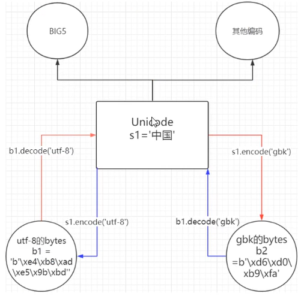

# 二进制

bytes类型编码

内部运行`Unicode`数据类型

```python
name = r'王\\t嘿嘿\\n' # 原生字符
b = b'\xe4\xe8\xad\xe5\x9b\xfa' # bytes
```

```python
# bytes类型-------------------
encoding:utf-8 # gbk
open(filename, 'wb', encoding = 'utf-8')

# 编码与解码-------------------
open(filename, 'rb') # 获取二进制数据，方便转码
s_1.encode('utf-8') # 编码 utf-8编码输出bytesencode类型
s_1.decode('utf-8') # 解码 bytes类型输出utf-8编码**
```

**文件编码的互相转换**



