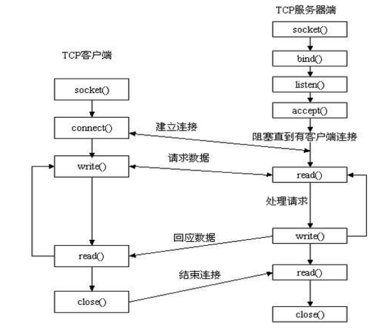

```python
# Server
import socket
HOST = '0.0.0.0'
PORT = 50007
sock_server = socket.socket(socket.AF_INET, socket.SOCK_STREAM)
sock_server.bind((HOST, PORT)) # 0.0.0.0|localhost 本机地址、 127.0.0.1 本地地址(不建议)
sock_server.listen(2) # 开始监听，1代表在允许有一个连接排队，更多的新连接连进来时就会被拒绝
client_conn, client_addr = sock_server.accept() # 阻塞直到有连接为止，有了一个新连接进来后，就会为这个请求生成一个连接对象

data = client_conn.recv(1024)
print(data.decode())
client_conn.send(data)

client_conn.close() # 关掉客服端的连接
sock_server.close() # 关掉服务器


# client
import socket
HOST = 'localhost'    # The remote host
PORT = 50007              # The same port as used by the server
client = socket.socket(socket.AF_INET, socket.SOCK_STREAM)
client.connect((HOST, PORT))
client.send('Hello, world'.encode())
# client.sendall(b'Hello, world') # 发送数据
data = client.recv(1024) # 接收数据
print('Received', data.dncode())
client.close() # 关掉客服端
```


### socket 实例类(8-10分钟)

```python
socket.socket(family=AF_INET, type=SOCK_STREAM, proto=0, fileno=None)
```

>   -   socket.AF_UNIX：用于本机进程间通讯，为了保证程序安全，两个独立的程序(进程)间是不能互相访问彼此的内存的，但为了实现进程间的通讯，可以通过创建一个本地的socket来完成
>   -   socket.AF_INET:(还有AF_INET6被用于ipv6，还有一些其他的地址家族，不过，他们要么是只用于某个平台，要么就是已经被废弃，或者是很少被使用，或者是根本没有实现，所有地址家族中，AF_INET是使用最广泛的一个，python支持很多种地址家族，但是由于我们只关心网络编程，所以大部分时候我么只使用AF_INET)
>       socket type类型
>   -   socket.SOCK_STREAM #for tcp
>   -   socket.SOCK_DGRAM #for udp
>   -   socket.SOCK_RAW #原始套接字，普通的套接字无法处理ICMP、IGMP等网络报文，而SOCK_RAW可以；其次，SOCK_RAW也可以处理特殊的IPv4报文；此外，利用原始套接字，可以通过IP_HDRINCL套接字选项由用户构造IP头。
>   -   socket.SOCK_RDM #是一种可靠的UDP形式，即保证交付数据报但不保证顺序。SOCK_RAM用来提供对原始协议的低级访问，在需要执行某些特殊操作时使用，如发送ICMP报文。SOCK_RAM通常仅限于高级用户或管理员运行的程序使用。
>   -   socket.SOCK_SEQPACKET #废弃了
>       (Only SOCK_STREAM and SOCK_DGRAM appear to be generally useful.)
>
>   proto=0 请忽略，特殊用途
>
>   fileno=None 请忽略，特殊用途

### 服务端套接字函数(2分钟)

```python
s.bind() # 绑定(主机,端口号)到套接字
s.listen() # 开始TCP监听
s.accept() # 被动接受TCP客户的连接,(阻塞式)等待连接的到来,
```

### 客户端套接字函数(2分钟)

```python
s.connect() # 主动初始化TCP服务器连接
s.connect_ex() # connect()函数的扩展版本,出错时返回出错码,而不是抛出异常
```

### 公共用途的套接字函数(3-5分钟)

```python
s.recv() # 接收数据
s.send() # 发送数据(send在待发送数据量大于己端缓存区剩余空间时,数据丢失,不会发完，可后面通过实例解释)
s.sendall() # 发送完整的TCP数据(本质就是循环调用send,sendall在待发送数据量大于己端缓存区剩余空间时,数据不丢失,循环调用send直到发完)
s.recvfrom() # Receive data from the socket. The return value is a pair (bytes, address)
s.getpeername() # 连接到当前套接字的远端的地址
s.close() # 关闭套接字
socket.setblocking(flag) #True or False,设置socket为非阻塞模式，以后讲io异步时会用
socket.getaddrinfo(host, port, family=0, type=0, proto=0, flags=0) # 返回远程主机的地址信息，例子 socket.getaddrinfo(‘luffycity.com’,80)
socket.getfqdn() # 拿到本机的主机名
socket.gethostbyname() # 通过域名解析ip地址
```

