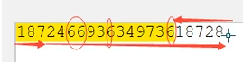

# re 模块

## 方法

**findall**

```python
import re
ret = re.findall('\d+', '1512512h\nejt32t', flags=re.S) # 返回查询到的数组
```

>   `flasg=re.S`效果为`.`也会匹配`\n`

**search**、**group**

```python
ret = re.search('\d+', '1512512hejt32t') # 返回首个查询或者None
if ret:
    print(ret.group())
```

>   注意：
>
>   -   search返回格式为正则类型，需用group打印结果
>
>   -   search返回None时，group会报错
>
>   -   如果表达式内有`()`，优先显示`()`匹配到的内容
>
>   -   group默认参数0返回所有，可指定返回第几个`()`分组的数据
>
>       ```python
>       ret = re.search('<\w+ (\w+=".*?")*>(.*?)</\w+>', '<p style="">123</p>', flags=re.S)
>       ret.group()
>       ret.group(1) # >>> 123
>       ```

**split**

```python
re.split('\d+','ueqwu21fwe') # 根据条件分割
# >>> ['ueqwu', 'fwe']
re.split('(\d+)','ueqwu21fwe') # 保留分组里的值
# >>> ['ueqwu', '21', 'fwe']
```

**sub**

```python
re.sub('\d+', '333', 'ueqwu21fwe22') # 根据条件替换
# >>> ueqwu333fwe333
re.sub('\d+', '333', 'ueqwu21fwe22', 1) # 根据条件替换1次
# >>> ueqwu333fwe22 
```

**subn**

```python
re.subn('\d+', '333', 'ueqwu21fwe22') # 根据条件替换并返回替换次数
# >>> 2
```

**match**

```python
ret = re.match('\d+', '122ueqwu21fwe22') # 开头匹配开始相当于'^\d+'
ret.group()
# >>> 122
```

>   match查询内容必须开头开始匹配
>
>   search查询内容必须开头开始匹配的子内容

**compile**

**finditer**

# 正则表达式

## 字符组

`[]`一个中括号表示一个字符位置

```
[0-9]
[abc]
[a-zA-Z] # 所有大小写字母
[0-9a-zA-Z] # 所有大小写字母和数字
```

>   注意：
>
>   -   `[A-z]`不建议使用，`Z-a`之间还有其它特殊字符
>   -   `0-9`表示的`ascii`的范围来匹配
>   -   `[^c]`表示不匹配`c`,而`^[c]`表示匹配`c`开头
>   -   `ab|abc`左边成功就不匹配右边，规则重叠建议类似父级放左边`abc|ab`

|元字符 |功能|
|:-     |:-|
|`^`    |匹配字符开头，若指定`flags MULTILINE`,这种也可以匹配上`(r"^a","\nabc\neee",flags=re.MULTILINE)`|
|`$`    |匹配字符结尾， 若指定`flags MULTILINE`,`re.search('foo.$','foo1\nfoo2\n',re.MULTILINE).group()` 会匹配到`foo1`|
|`\A`   |只从字符开头匹配，`re.search("\Aabc","alexabc")` 是匹配不到的，相当于`re.match('abc',"alexabc")` 或`^`|
|`\Z`   |匹配字符结尾，同`$` |
|`\d`   |匹配`数字0-9`|
|`\D`   |匹配`非数字`|
|`\w`   |匹配`[A-Za-z0-9]`|
|`\W`   |匹配`非[A-Za-z0-9]`|
|` `    |匹配`空格`|
|`\t`   |匹配`tab`|
|`\n`   |匹配`回车`|
|`\s`   |匹配`空白字符`、`\t`、`\n`、`\r` , `re.search("\s+","ab\tc1\n3").group()` 结果 `'\t'`|
|`\S`   |匹配`非空白字符`|
|`\b`   |匹配`单词边界`，如匹配以o结尾的单词|


|量词 |功能|
|:-     |:-|
|`.`    |默认匹配除`\n`之外的任意一个字符，若指定`flags=re.S`,则匹配任意字符，包括`换行`|
|`*`    |匹配`*`号前的字符0次或多次， `re.search('a*','aaaabac')`  结果`'aaaa'`|
|`+`    |匹配前一个字符1次或多次，`re.findall("ab+","ab+cd+abb+bba")` 结果`['ab', 'abb']`|
|`?`    |匹配前一个字符1次或0次 ,`re.search('b?','alex').group()` 匹配b 0次|
|`{m}`  |匹配前一个字符`m`次 ,`re.search('b{3}','alexbbbs').group()`  匹配到`'bbb'`|
|`{n,m}`|匹配前一个字符`n`到`m`次，`re.findall("ab{1,3}","abb abc abbcbbb")` 结果`['abb', 'ab', 'abb']`|
|`|`    | 或 |
|`(...)`|分组匹配， `re.search("(abc){2}a(123|45)", "abcabca456c").group()` 结果为`'abcabca45'`|
|`(?P...)` |分组匹配 `re.search("(?P[0-9]{4})(?P[0-9]{2})(?P[0-9]{4}`|

## 贪婪匹配

```
1565253612456235125123
\d{3,}6 # 匹配至最后一个6
```

>   这里涉及到`回溯算法`，将会查询到结尾后再往回查询6
>
>   

## 非贪婪匹配

在量词后加个`?`


```
\d{3,}?6 # 匹配至第一个6
```

```
13??3 # 第一个?表示量词，第二个?表示前个量词为非贪婪匹配
.*?x # 匹配任意字符，任意次数，遇到x就停下
```

## 转义字符

添加`\`或放入`[]`中

```
\.
[().*+?]
[\\d]
```

>   注意：
>
>   -   `[a-b]`放在字符组两个字符中间表示范围
>   -   `[-a-]`在开头或结尾才不代表范围
>   -   `[\d\w]`会保留其特殊意义需要将反斜杠转义

